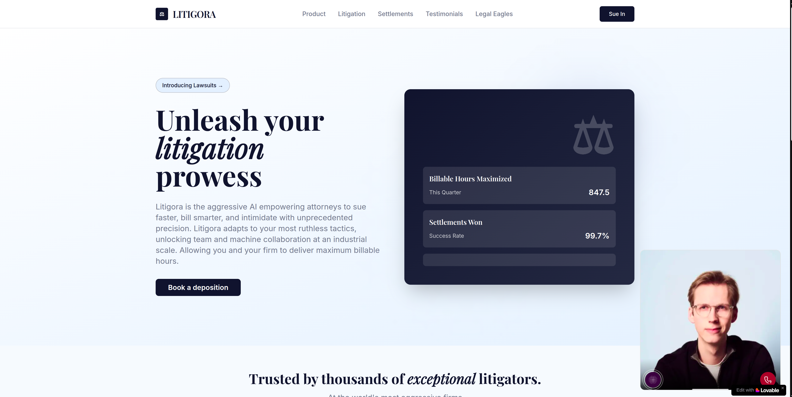
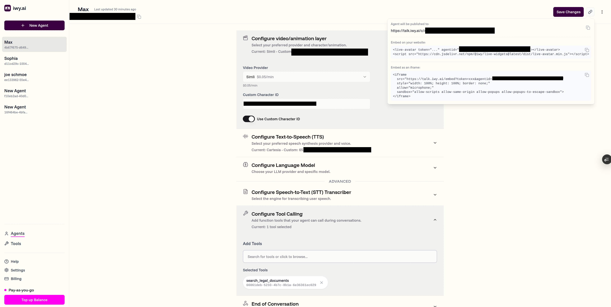
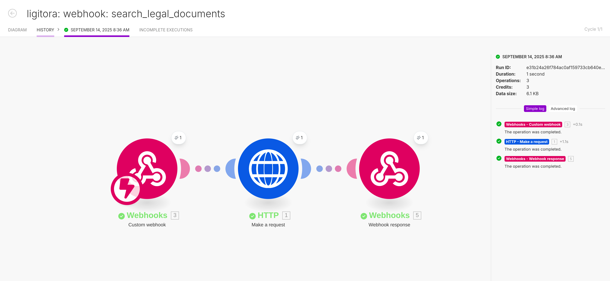
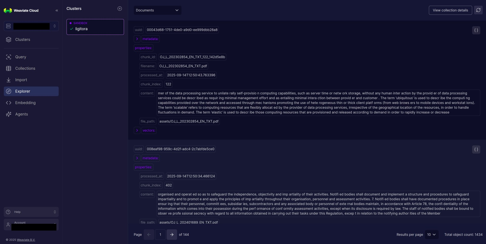

# Litigora

Introducing Litigora, an AI lawyer specializing in GDPR and EU regulations. It operates through conversational technology and is connected to a backend vector database that contains key legal documents. This AI expert touches on the upcoming European AI Regulation Act and previous laws that have been released. It is inteded to be used to better understand GDPR and EU regulations and their implications.

NOTE: Hackacthon submission, {Tech: Europe}, Stockholm, Sept 2025

## How to use

https://litigora.lovable.app

## Project Architecture

  

## Tech stack

- Weaviate - vector database containing legal documents (these were uploaded using the script at vectorize.py, which ingests the assets found at /assets)

- Lovable - used to build, design and deploy the frontend 

- Make.com - to connect function calling of iwy.ai to the weaviate vector database endpoint

- iwy.ai - model hosting and orchestration, specifically: openai gpt-4o, cartesia for TTS and deepgram for STT, and (Simli & Beyond Precense for video-avatar)

## Screenshots

  
  
  
  

## Demo

Watch a quick demo of Litigora in action: [Loom Demo Video](https://www.loom.com/share/d08dd8620db547f99b6e4801fd6e30d4?sid=033a728a-371e-445f-8cd2-9afafa57686b)

## Contributors:

- [@svemyh](https://github.com/svemyh)
- [@sebastianrb05](https://github.com/sebastianrb05)
- [@OliverNakamoto](https://github.com/OliverNakamoto)
- [@larstalian](https://github.com/larstalian)
